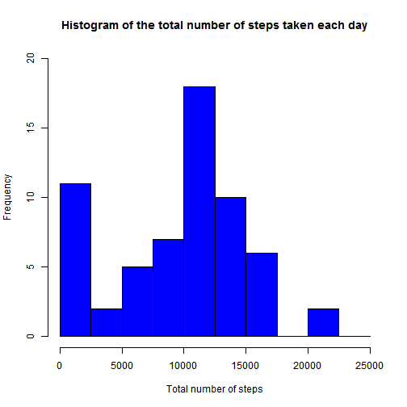
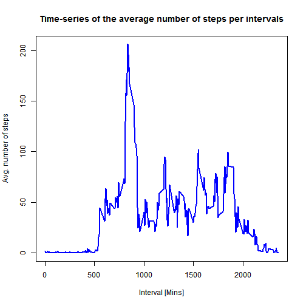
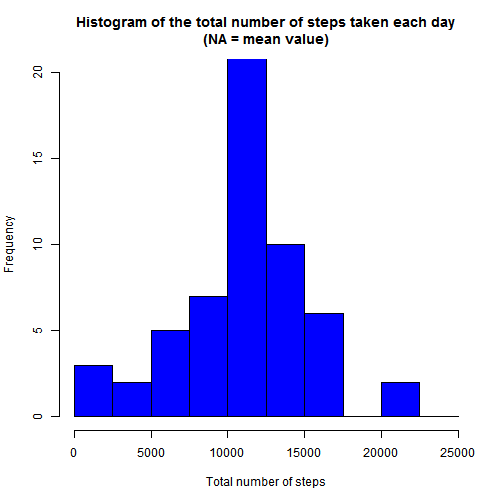
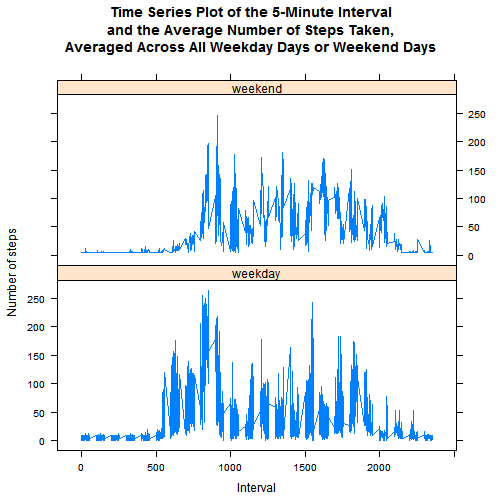

## Loading and preprocessing the data

```r
# Load the raw activity data
activity_raw <- read.csv("activity.csv", stringsAsFactors=FALSE)
```

## What is mean total number of steps taken per day?

```r
# Calculate the total number of steps taken per day
sum_data <- aggregate(activity_raw$steps, by=list(activity_raw$date), FUN=sum, na.rm=TRUE)
names(sum_data) <- c("date", "total")

# Make a histogram of the total number of steps taken each day
hist(sum_data$total, breaks=seq(from=0, to=25000, by=2500), col="blue", 
     xlab="Total number of steps", 
     ylim=c(0, 20), 
     main="Histogram of the total number of steps taken each day")
```

 

```r
# Calculate and report the mean and median of the total number of steps taken per day
mean(sum_data$total)
```

```
## [1] 9354.23
```

```r
median(sum_data$total)
```

```
## [1] 10395
```

## What is the average daily activity pattern?

```r
# Make a time series plot (i.e. type = "l") of the 5-minute interval (x-axis) and the average number of steps taken, averaged across all days (y-axis)
mean_data <- aggregate(activity_raw$steps, 
                       by=list(activity_raw$interval), 
                       FUN=mean, 
                       na.rm=TRUE)
names(mean_data) <- c("interval", "mean")
head(mean_data)
```

```
##   interval      mean
## 1        0 1.7169811
## 2        5 0.3396226
## 3       10 0.1320755
## 4       15 0.1509434
## 5       20 0.0754717
## 6       25 2.0943396
```

```r
plot(mean_data$interval, 
     mean_data$mean, 
     type="l", 
     col="blue", 
     lwd=2, 
     xlab="Interval [Mins]", 
     ylab="Avg. number of steps", 
     main="Time-series of the average number of steps per intervals")
```

 

```r
# Which 5-minute interval, on average across all the days in the dataset, contains the maximum number of steps?
mean_data[mean_data$mean == max(mean_data$mean),]
```

```
##     interval     mean
## 104      835 206.1698
```

## Imputing missing values

```r
without_na <- activity_raw[complete.cases(activity_raw),]

# Calculate and report the total number of missing values in the dataset
nrow(activity_raw[is.na(activity_raw$steps),])
```

```
## [1] 2304
```

```r
# Devise a strategy for filling in all of the missing values in the datase & Create a new dataset
# Create a vector of means 
na_pos <- which(is.na(activity_raw$steps))
mean_vec <- rep(mean(activity_raw$steps, na.rm=TRUE), times=length(na_pos))
activity_raw[na_pos, "steps"] <- mean_vec

# Make a histogram of the total number of steps taken each day and Calculate and report the mean and median total number of steps taken per day.
rm(sum_data)
sum_data <- aggregate(activity_raw$steps, by=list(activity_raw$date), FUN=sum)
names(sum_data) <- c("date", "total")

# Make a histogram of the total number of steps taken each day
hist(sum_data$total, breaks=seq(from=0, to=25000, by=2500), col="blue", 
     xlab="Total number of steps", 
     ylim=c(0, 20), 
     main="Histogram of the total number of steps taken each day\n(NA = mean value)")
```

 

```r
# Do these values differ from the estimates from the first part of the assignment? 
mean(sum_data$total)
```

```
## [1] 10766.19
```

```r
median(sum_data$total)
```

```
## [1] 10766.19
```
Yes there are minor differences.

## Are there differences in activity patterns between weekdays and weekends?

```r
# Create a new factor variable in the dataset with two levels - "weekday" and "weekend"
activity_raw$date <- as.POSIXct(activity_raw$date, format="%Y-%m-%d")
activity_raw <- data.frame(date=activity_raw$date, 
                           weekday=tolower(weekdays(activity_raw$date)), 
                           steps=activity_raw$steps, 
                           interval=activity_raw$interval)
activity_raw <- cbind(activity_raw, 
                      daytype=ifelse(activity_raw$weekday == "saturday" | 
                                     activity_raw$weekday == "sunday", "weekend", 
                                     "weekday"))
activity <- data.frame(date=activity_raw$date, 
                       weekday=activity_raw$weekday, 
                       daytype=activity_raw$daytype, 
                       interval=activity_raw$interval,
                       steps=activity_raw$steps)

# Make a panel plot containing a time series plot (i.e. type = "l") of the 5-minute interval (x-axis) and the average number of steps taken, averaged across all weekday days or weekend days (y-axis).
library(lattice)

mean_data <- aggregate(activity$steps, 
                       by=list(activity$daytype, 
                               activity$weekday, activity$interval), mean)
names(mean_data) <- c("daytype", "weekday", "interval", "mean")

xyplot(mean ~ interval | daytype, mean_data, type="l",
       xlab="Interval", 
       ylab="Number of steps",
       main = "Time Series Plot of the 5-Minute Interval\nand the Average Number of Steps Taken,\nAveraged Across All Weekday Days or Weekend Days",
       layout=c(1,2))
```

 
